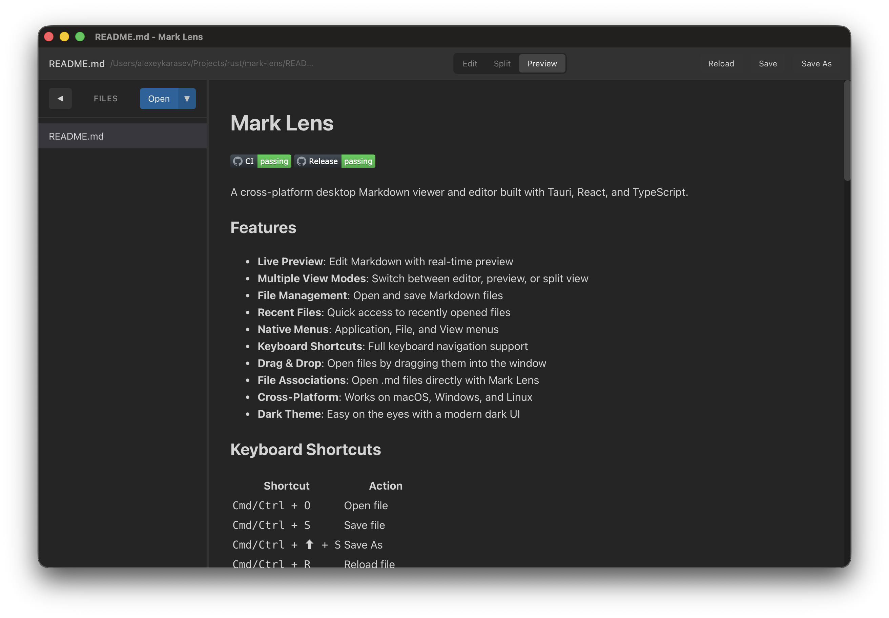

# Mark Lens

A cross-platform desktop Markdown viewer and editor built with Tauri, React, and TypeScript.

## Download

| macOS                                                                                                                                                                   | Windows                                                                                                                                                                    | Linux                                                                                                                                                                          |
| ----------------------------------------------------------------------------------------------------------------------------------------------------------------------- | -------------------------------------------------------------------------------------------------------------------------------------------------------------------------- | ------------------------------------------------------------------------------------------------------------------------------------------------------------------------------ |
|  |  |  |

**Alternative formats:**

- **macOS**: [Universal DMG](https://github.com/Enot-Racoon/mark-lens/releases/download/v0.1.1/Mark.Lens_0.1.1_universal.dmg)
- **Windows**: [MSI](https://github.com/Enot-Racoon/mark-lens/releases/download/v0.1.1/Mark.Lens_0.1.1_x64_en-US.msi)
- **Linux**: [DEB](https://github.com/Enot-Racoon/mark-lens/releases/download/v0.1.1/Mark.Lens_0.1.1_amd64.deb)

## Features

- **Live Preview**: Edit Markdown with real-time preview
- **Multiple View Modes**: Switch between editor, preview, or split view
- **File Management**: Open and save Markdown files
- **Recent Files**: Quick access to recently opened files
- **Native Menus**: Application, File, and View menus
- **Keyboard Shortcuts**: Full keyboard navigation support
- **Drag & Drop**: Open files by dragging them into the window
- **File Associations**: Open .md files directly with Mark Lens
- **Cross-Platform**: Works on macOS, Windows, and Linux
- **Dark Theme**: Easy on the eyes with a modern dark UI

## Keyboard Shortcuts

| Shortcut           | Action            |
| ------------------ | ----------------- |
| `Cmd/Ctrl + O`     | Open file         |
| `Cmd/Ctrl + S`     | Save file         |
| `Cmd/Ctrl + ⬆ + S` | Save As           |
| `Cmd/Ctrl + R`     | Reload file       |
| `Cmd/Ctrl + W`     | Close window      |
| `Cmd/Ctrl + Q`     | Quit application  |
| `Cmd/Ctrl + F`     | Toggle fullscreen |

## Tech Stack

- **Frontend**: React 19, TypeScript, Vite
- **Desktop Framework**: Tauri 2
- **State Management**: Zustand
- **Markdown Parsing**: marked
- **Testing**: Vitest, React Testing Library

## License

MIT
